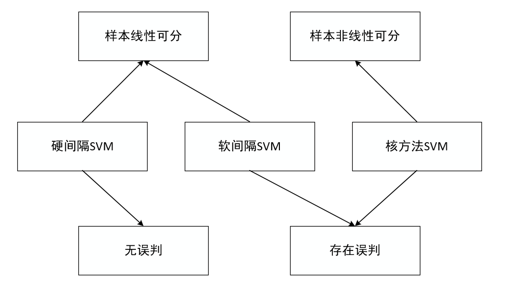

# 支持向量机（SVM）

&emsp;&emsp;支持向量机（Support Vector Machine，SVM）主要有三种：硬间隔、软间隔和核方法。三种各不相同，其中硬间隔SVM将所有样本都正确分类，在理论分析方面便于理解，而实际应用中不可实现，因为样本总是存在噪声，不可能全部线性可分。因此，提出了软间隔SVM，允许部分样本误判，实现样本特征的线性可分。硬间隔SVM和软间隔SVM都是基于样本特征空间线性可分的，实际应用中，样本特征肯定不是完全的线性可分，因此将核方法引入SVM，得到Kernel-SVM，可以实现样本的非线性分类。

图1 硬间隔、软间隔、核方法SVM区别

**之前在学习时，听别人说了这样一句话：支持向量机有三宝：间隔、对偶、核技巧。个人觉得这句话对支持向量机有了深刻的概况**

## 一、硬间隔SVM

&emsp;&emsp;SVM就是需要找到一个超平面，将不同类别的样本区分开来。如图1.1所示，每一个样本有两个特征$x_1$和$x_2$。其中+表示正样本，-表示负样本。通过图1.1可以较为清除的观察到，存在一个超平面，可以将正负样本区分开来。但是，这样的超平面有无限个，应该如何找到这个超平面？

图1.1 样本空间（来自周志华《机器学习》）

&emsp;&emsp;首先，根据图1.1的几何意义，得到SVM的数学方程。设样本点有N个 $\{(x_i,y_i)\}^N_{i=1}$ ，其中$x_i$是一个二维的向量，$y_i$为样本的标签，$y_i=\{+1,-1\}$。

&emsp;&emsp;目标函数为样本点到超平面的距离，约束条件表示每一个样本点都可以正确分类。公式（1.1）表示在每一个样本都可以正确分类的情况下，样本点到超平面的最小距离最大。这样，可以在样本数据存在噪声的情况下，仍然可以正确分类。但是，公式（1）无法直接实现，或者实现比较麻烦，需要对上述公式进行转换，便于计算机计算。

&emsp;&emsp;结合公式（1.1）的约束条件和目标函数，发现${{y_i}\left( {{{\rm{w}}^T} \cdot {{\bf{x}}_i} + b} \right)}$和目标函数的分母是等价的。因为$y_1=\pm1$且${{y_i}\left( {{{\rm{w}}^T} \cdot {{\bf{x}}_i} + b} \right) \ge 0}$，故公式（1.1）变为：

&emsp;&emsp;目标函数的min只是对样本的数据进行求最小值，可以对公式进行转换：

&emsp;&emsp;根据约束条件，可以假设存在$\gamma>0$，使得${{y_i}\left( {{{\rm{w}}^T} \cdot {{\bf{x}}_i} + b} \right)}$的最小值等于$\gamma$。由于超平面参数$\pmb{w},b$可以进行伸缩变换（$\begin{array}{l}
{{\rm{w}}^T} \cdot {{\bf{x}}_i} + b = \gamma \\
\frac{{{{\rm{w}}^T}}}{\gamma } \cdot {{\bf{x}}_i} + \frac{b}{\gamma } = 0
\end{array}$）表示同一个超平面，因此参数$\gamma$表示任何一个数都可以，通常设置$\gamma=1$。因此，公式（1.3）转换为：

&emsp;&emsp;公式（1.4）的目标函数不便于直接优化，需要进行修改，求${\frac{1}{{\left\| {\rm{w}} \right\|}}}$的最大值就是求${\left\| {\rm{w}} \right\|}$的最小值，也等价于求${{\frac{1}{2}\rm{w}}^T} \cdot {\rm{w}}$的最小值。故公式（1.4）转换为：

&emsp;&emsp;公式（1.5）是典型的凸优化问题，可以直接进行计算，但是当样本特征个数较多时，运算复杂。故引入拉格朗日乘子法得到公式（1.5）的对偶问题。

&emsp;&emsp;拉格朗日函数为：

&emsp;&emsp;其中，$\lambda_i>0$。故公式（1.6）带入公式（1.5）得：

&emsp;&emsp;由于约束条件只有$\lambda$，故可以将目标函数改为$\begin{array}{*{20}{c}}
{\mathop {\max }\limits_\lambda  }&{\mathop {\min }\limits_{{\rm{w}},b} }&{L\left( {{\rm{w}},b,\lambda } \right)}
\end{array}$，这样可以将最小值部分求出来，由于目标函数是凸函数，必然存在最小值且最小值为${{\rm{w}},b}$的偏导数为0的位置。对拉格朗日函数求偏导得：

&emsp;&emsp;将公式（1.8）带入公式（1.7）可得：

&emsp;&emsp;在进行对偶问题转换过程中，需要保证满足强对偶关系，即KKT条件，如下式所示。

&emsp;&emsp;由KKT条件可知，只有在离超平面最近的点的$\lambda>0$，其他的样本点$\lambda=0$。只需要对部分样本进行带入即可。公式（1.9）仍然是一个二次优化问题，具体算法可以参考SMO算法。

## 二、软间隔SVM

## 三、核方法SVM

