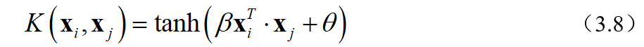

&emsp;&emsp;该篇博客介绍了支持向量机的硬间隔、软间隔、核方法三种理论，并介绍了Python的实现方法，如果有什么问题或者疑问麻烦评论区指出（第一次分享理论知识，可能思路不是很清晰）。（本博主以后会在CSDN分享自己的知识和体会，帮助大家避坑）

&emsp;&emsp;另外，关于支持向量机的理论和实现我会在B站进行发布相关视频，目前正在准备，如果文字不好理解的话请移步B站视频，对理论进行手推。


# 支持向量机（SVM）

&emsp;&emsp;支持向量机（Support Vector Machine，SVM）主要有三种：硬间隔、软间隔和核方法。三种各不相同，其中硬间隔SVM将所有样本都正确分类，在理论分析方面便于理解，而实际应用中难实现，因为样本总是存在噪声，不可能全部线性可分。因此，提出了软间隔SVM，允许部分样本误判，实现样本特征的线性可分。硬间隔SVM和软间隔SVM都是基于样本特征空间线性可分的，实际应用中，样本特征可能不是完全的线性可分，因此将核方法引入SVM，得到Kernel-SVM，可以实现样本的非线性分类。

<center>


<center>图1 硬间隔、软间隔、核方法SVM区别</center>
**之前在学习时，听别人说了这样一句话：支持向量机有三宝：间隔、对偶、核技巧。个人觉得这句话对支持向量机有了深刻的概况**

## 一、硬间隔SVM

&emsp;&emsp;SVM就是需要找到一个超平面，将不同类别的样本区分开来。如图1.1所示，每一个样本有两个特征$x_1$和$x_2$。其中+表示正样本，-表示负样本。通过图1.1可以较为清除的观察到，存在一个超平面，可以将正负样本区分开来。但是，这样的超平面有无限个，应该如何找到这个超平面？

<center>


<center>图1.1 样本空间（来自周志华《机器学习》）</center>
&emsp;&emsp;首先，根据图1.1的几何意义，得到SVM的数学方程。设样本点有N个 $\{(x_i,y_i)\}^N_{i=1}$ ，其中$x_i$是一个二维的向量，$y_i$为样本的标签，$y_i=\{+1,-1\}$。

<center>
&emsp;&emsp;目标函数为样本点到超平面的距离，约束条件表示每一个样本点都可以正确分类。公式（1.1）表示在每一个样本都可以正确分类的情况下，样本点到超平面的最小距离最大。这样，可以在样本数据存在噪声的情况下，仍然可以正确分类。但是，公式（1）无法直接实现，或者实现比较麻烦，需要对上述公式进行转换，便于计算机计算。

&emsp;&emsp;结合公式（1.1）的约束条件和目标函数，发现${{y_i}\left( {{{\rm{w}}^T} \cdot {{\bf{x}}_i} + b} \right)}$和目标函数的分母是等价的。因为$y_1=\pm1$且${{y_i}\left( {{{\rm{w}}^T} \cdot {{\bf{x}}_i} + b} \right) \ge 0}$，故公式（1.1）变为：

<center>
&emsp;&emsp;目标函数的min只是对样本的数据进行求最小值，可以对公式进行转换：

<center>
&emsp;&emsp;根据约束条件，可以假设存在$\gamma>0$，使得${{y_i}\left( {{{\rm{w}}^T} \cdot {{\bf{x}}_i} + b} \right)}$的最小值等于$\gamma$。由于超平面参数$\pmb{w},b$可以进行伸缩变换（$\begin{array}{l}
{{\rm{w}}^T} \cdot {{\bf{x}}_i} + b = \gamma \\
\frac{{{{\rm{w}}^T}}}{\gamma } \cdot {{\bf{x}}_i} + \frac{b}{\gamma } = 0
\end{array}$）表示同一个超平面，因此参数$\gamma$表示任何一个数都可以，通常设置$\gamma=1$。因此，公式（1.3）转换为：

<center>
&emsp;&emsp;公式（1.4）的目标函数不便于直接优化，需要进行修改，求${\frac{1}{{\left\| {\rm{w}} \right\|}}}$的最大值就是求${\left\| {\rm{w}} \right\|}$的最小值，也等价于求${{\frac{1}{2}\rm{w}}^T} \cdot {\rm{w}}$的最小值。故公式（1.4）转换为：

<center>
&emsp;&emsp;公式（1.5）是典型的凸优化问题，可以直接进行计算，但是当样本特征个数较多时，运算复杂。故引入拉格朗日乘子法得到公式（1.5）的对偶问题。

&emsp;&emsp;拉格朗日函数为：

<center>
&emsp;&emsp;其中，$\lambda_i>0$。故公式（1.6）带入公式（1.5）得：

<center>

&emsp;&emsp;由于约束条件只有$\lambda$，故可以将目标函数改为$\begin{array}{*{20}{c}}
{\mathop {\max }\limits_\lambda  }&{\mathop {\min }\limits_{{\rm{w}},b} }&{L\left( {{\rm{w}},b,\lambda } \right)}
\end{array}$，这样可以将最小值部分求出来，由于目标函数是凸函数，必然存在最小值且最小值为${{\rm{w}},b}$的偏导数为0的位置。对拉格朗日函数求偏导得：

<center>
&emsp;&emsp;将公式（1.8）带入公式（1.7）可得：

<center>
&emsp;&emsp;在进行对偶问题转换过程中，需要保证满足强对偶关系，即KKT条件，如下式所示。

<center>
&emsp;&emsp;由KKT条件可知，只有在离超平面最近的点的$\lambda>0$，其他的样本点$\lambda=0$。只需要对部分样本进行带入即可。公式（1.9）仍然是一个二次优化问题，具体算法可以参考SMO算法。

## 二、软间隔SVM

&emsp;&emsp;在进行样本分类过程中，对于大部分样本是线性可分的，少部分样本无法有效分类，因此提出了软间隔SVM，允许部分样本分类错误。理论推导过程如下所示。

&emsp;&emsp;对于分类错误的样本，引入损失函数，将错误分类的样本造成的损失加入目标函数，通过优化可以在允许少部分样本分类错误的情况下，目标函数达到最小值。损失函数有很多中，如0/1损失函数，hinge损失函数等等。在这里以hinge损失函数为例，其他损失函数推导类似。hinge损失函数为：

<center>
&emsp;&emsp;为方便后续推导，将hinge损失函数用下式表示：

<center>

&emsp;&emsp;故软间隔SVM的模型为：

<center>

&emsp;&emsp;和硬间隔SVM类似，高模型直接求解较复杂，需要优化。引入拉格朗日乘数法得到模型的对偶问题，进而对模型求解。拉格朗日函数为：

<center>

&emsp;&emsp;对拉格朗日函数求偏导得：

<center>

&emsp;&emsp;然后将公式（2.6）带入到公式（2.4)即可得到模型的对偶问题

<center>

&emsp;&emsp;为满足强对偶关系，模型需要满足KKT条件：

<center>

## 三、核方法SVM

&emsp;&emsp;核方法其实和SVM并没有什么关系，只是核方法引入支持向量机可以使得SVM实现非线性划分的分类。核方法在思想上是将低维的线性不可分样本通过非线性变换得到高维线性可分样本，在高维特征空间可以实现SVM的分类。

<center>

&emsp;&emsp;如公式（3.1）所示，原始特征空间是低维的、有限的，在该空间的样本可能无法线性划分，因此通过非线性映射，将样本转换为高维（也可以是无限维）的特征空间，在高维的特征空间样本先行可划分。这样就将原始空间的线性不可划分问题转换为高维特征空间线性可划分问题。由于只是对样本特征的变换，之前的理论推导公式只需要将特征数据更换即可，推导过程不变，替换后得到核方法的凸优化模型。

<center>

<center>

&emsp;&emsp;但是，${\phi \left( {{{\bf{x}}_i}} \right)}$是无限维的，直接计算${\phi {{\left( {{{\bf{x}}_i}} \right)}^T} \cdot \phi \left( {{{\bf{x}}_j}} \right)}$通常是十分困难的，为了克服这个障碍，引入核函数来解决。

<center>

&emsp;&emsp;引入核函数后，不需要计算高维特征空间的卷积，直接求解核函数即可，大大减少了运算量。通常的核函数有以下几种：

- 线性核函数：

<center>

- 多项式核函数：

<center>

- 高斯核函数：

<center>

- 拉普拉斯核函数：

<center>

- Sigmoid核函数：

<center>

# 四、Python实现方法

&emsp;&emsp;SVM算法在在Python的sklearn库中有API，可以直接调用即可搭建SVM模型。

```Python
class sklearn.svm.SVC(C=1.0, kernel='rbf', degree=3, gamma='scale', coef0=0.0, shrinking=True, probability=False, tol=0.001, cache_size=200, class_weight=None, verbose=False, max_iter=-1, decision_function_shape='ovr', break_ties=False, random_state=None)
```

&emsp;&emsp;通常使用的核函数为高斯核函数，这里以高斯核函数为例，一般大部分参数采用默认即可。其他参数可以通过官网查看。

[sklearn-SVM]: https://scikit-learn.org/stable/modules/generated/sklearn.svm.SVC.htm

```Python
from sklearn import svm
model = svm.SVC(C=1.0,
                gamma='scale', 
                kernel='rbf',
                class_weight='balanced')
```

- C：正则化超参数，为损失函数的权重。
- gamma：核函数的超参数。
- kernel：核函数
- class_weight：样本损失函数权重，默认相等，也可以设置类别的损失函数为不同值（需要根据一些理论依据决定）

&emsp;&emsp;因此，对于高斯核函数的SVM只有两个超参数C和gamma，需要对超参数寻优，通常使用两种方法，一是网格搜索，另外一种是随即搜索。两种方法各有各的优点，具体理论可以参考相关书籍。

1. 网格搜索

```Python
from sklearn.model_selection import GridSearchCV
from sklearn import svm

class_weight = "balanced"
kernel = 'rbf'
C = np.linspace(0.01, 20, 40) # [0.01, 20]等间隔分40个点
gamma = np.linspace(0.01, 30, 80) # [0.01, 30]等间隔分80个点
parameters = dict(gamma=gamma, C=C)
clf = GridSearchCV(svm.SVC(kernel=kernel, class_weight=class_weight), 
                   parameters, cv=10, return_train_score=True) # 网格搜索
clf.fit(train, train_label) # 训练模型,train为样本特征值，train_label为样本标签
# 训练后得到最优超参数C和gamma
# C: clf.best_params_['C']
# gamma: clf.best_params_['gamma']
```

2. 随机搜索

```Python
from sklearn.model_selection import RandomizedSearchCV
from sklearn import svm
from scipy import stats

class_weight = "balanced"
kernel = 'rbf'
C = stats.uniform(loc=0.1, scale=20) # 均匀连续随机变量[0.1, 20.1]
gamma = stats.uniform(loc=0.1, scale=30) # 均匀连续随机变量[0.1, 30.1]
n_iter_search = 1200
params = dict(C=C, gamma=gamma)
clf = RandomizedSearchCV(svm.SVC(kernel=kernel, class_weight=class_weight),
                          param_distributions=params,
                          cv=10, n_iter=n_iter_search)
clf.fit(x_train, y_train)
```


